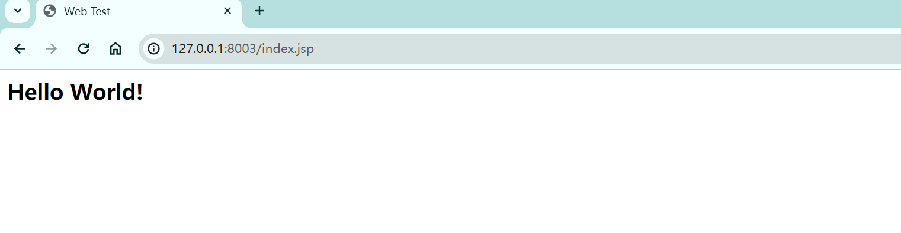
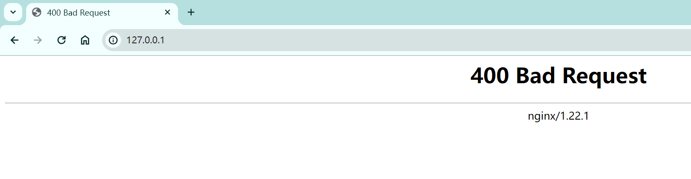
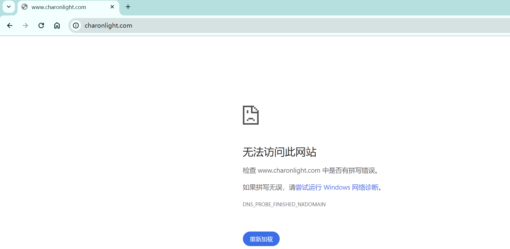
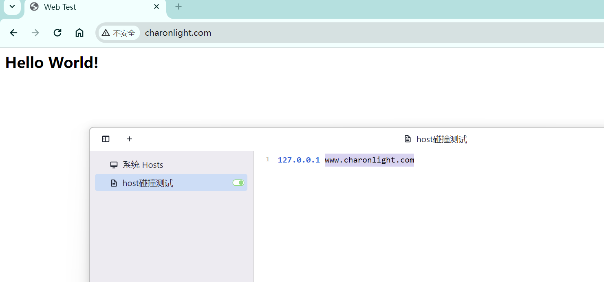
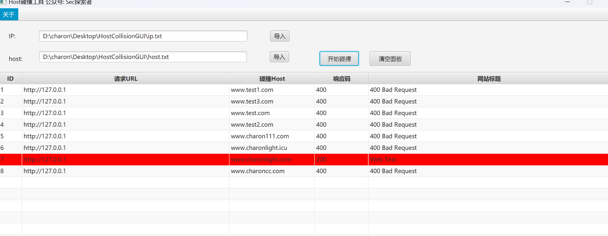

工具如果有误报什么的,欢迎大家提Issues

### 0x01 前言

​		当访问目标网站时，通常无法直接使用真实IP，只有通过域名才能连接到后端业务服务。这是因为反向代理服务器（如nginx）禁止了直接IP访问。有时候，后端业务会保持隐秘，例如测试业务可能不会向外界开放。以前的DNS解析可能指向了外网，但后来删除了A记录，可能将业务迁移到了内网进行访问。


### 0x02 原理复现分析

首先使用Tomcat起一个web服务 http://127.0.0.1:8003/index.jsp



使用nginx做反向代理

```
	server {
		listen  80  default_server;
		server_name _;
		return 400;
	}
	server {
		listen  80;
		server_name www.charonlight.com;


		location / {
			proxy_pass http://127.0.0.1:8003/index.jsp;
			proxy_redirect off;
			proxy_set_header Host $host:$server_port;
			proxy_set_header X-Real-IP $remote_addr;
				root    html;
			index   index.html  index.htm;
		}
		access_log logs/test.com.log;
	}
```

效果如下，即访问 http://127.0.0.1:80 会返回400，直接访问域名也是访问不到的





但是当我们配置host进行访问时，即可访问




师傅们环境不会搭建可以参考如下

nginx下载安装：https://blog.csdn.net/CSDN_Admin0/article/details/115640547

tomcat下载安装：https://blog.csdn.net/qq_46390120/article/details/128450109


### 0x03 自动化工具使用

直接导入需要碰撞的IP和域名，工具多线程碰撞速度快，访问状态码200成功时则会高亮。（注不是说只有200才算碰撞成功，具体可以根据网站标题进行判断）,后续我会升级下判定规则




### 0x04 免责声明

该开源工具是由作者按照开源许可证发布的，仅供个人学习和研究使用。作者不对您使用该工具所产生的任何后果负任何法律责任。


